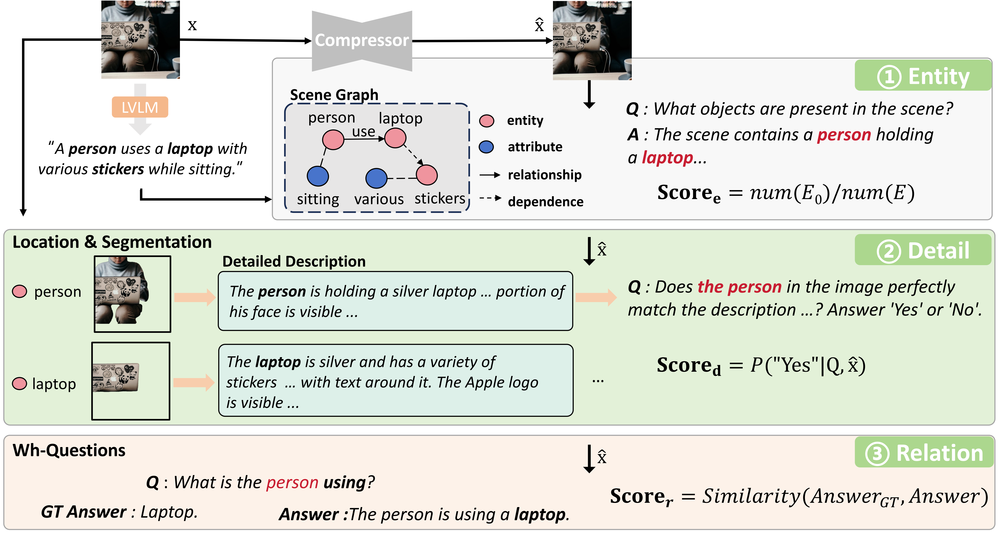

# MG-VLQA: Multi-Granularity Quality Assessment for Image Compression via Visual Language Models

> An image quality assessment framework leveraging visual-language models for multi-granularity semantic fidelity.

  

Hanfei Li1 &nbsp;·&nbsp;
Anle Ke1 &nbsp;·&nbsp;
Jiawen Gu2 &nbsp;·&nbsp;
Chao Zhou2 &nbsp;·&nbsp;
Tong Chen1 &nbsp;·&nbsp;
Zhan Ma1 &nbsp;·&nbsp;

1 Nanjing University &nbsp;&nbsp;&nbsp;
2 Kuaishou Technology

